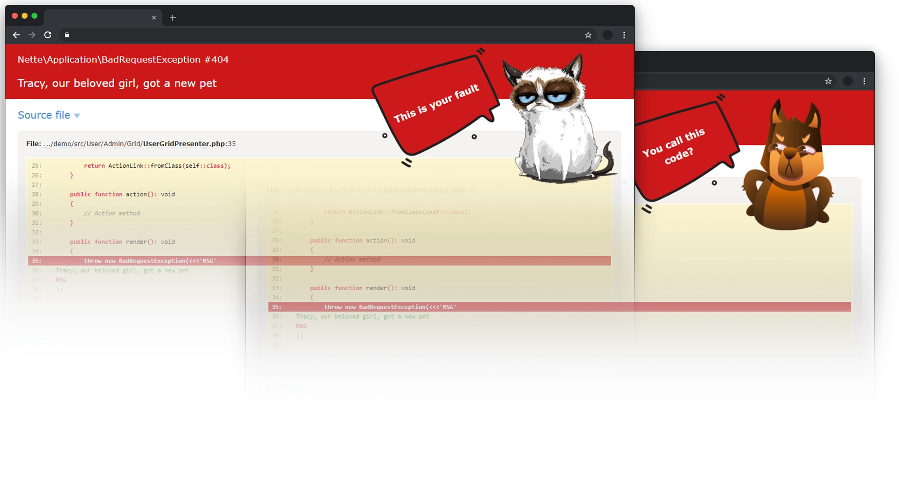

<h1 align="center">
	
	 
	Tracy Pets
</h1>

    <a href="https://tracy.nette.org">Tracy</a> got an angry pet to remind you of your failures

	📄 Check out our <a href="docs/README.md">documentation</a>.

	💸 If you like Orisai, please <a href="https://orisai.dev/sponsor">make a donation</a>. Thank you!

	
	
	
	
	
	

##

> This package is inspired by [grumpy error bundle](https://github.com/kiler129/grumpy-error-bundle)
> from [Grzegorz Zdanowski](https://github.com/kiler129). Thank you, Grzegorz!

